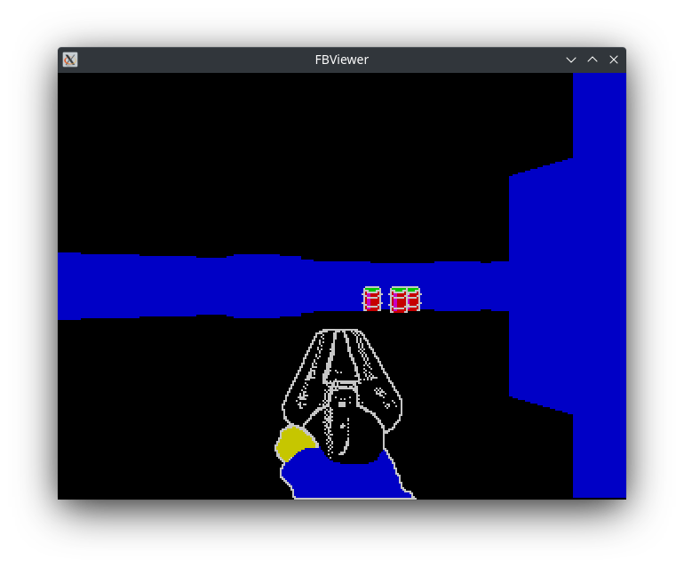
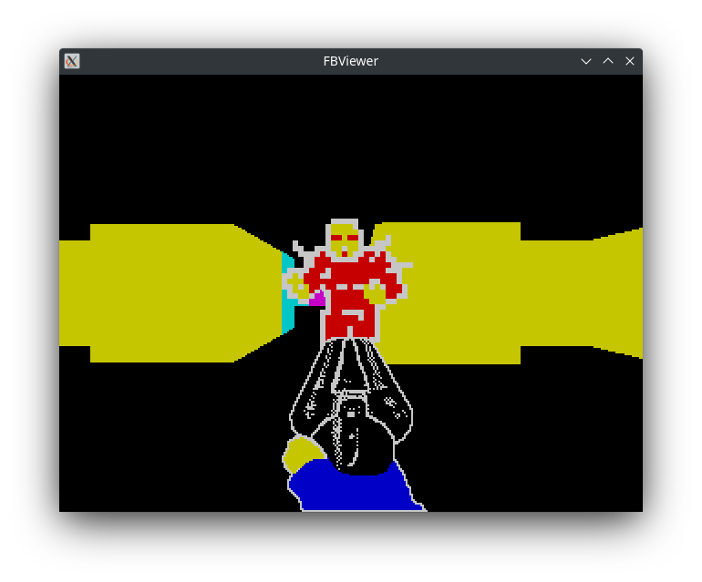
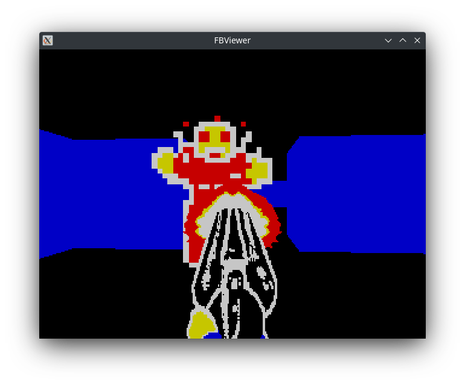

# Helix

A Doom/Wolfenstein3D-like first person shooter game developed for professor Milan Vidaković's [FPGA Computer](https://github.com/milanvidakovic/FPGAComputer32) with a simple raycasting 3D engine. The game features a sample level with a destructible environment and zombie enemies for the player to fight.

## Screenshots





## Usage

Compile with provided makefile and run it using the emulator from [modules](https://github.com/milanvidakovic/modules).

Custom sprites can be added by converting the 32x32 PNG images to bitmap arrays using the `img_to_src.py` python script.

```
python img_to_src.py -o sprites.c sprites/mysprite.png
```
